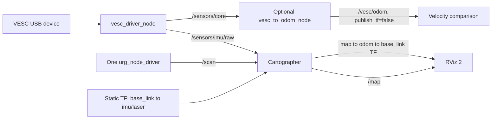

# F1Tenth Autonomous Racing Platform

This repository contains our ROS 2 F1Tenth vehicle stack for localization, mapping,
trajectory generation, vehicle control, and autonomous-racing experiments. The current
milestone integrates the VESC IMU and Hokuyo LiDAR into Cartographer and publishes a
real-time vehicle pose and occupancy grid for RViz 2.

## Current milestone: LiDAR-IMU localization

- VESC IMU published as `sensor_msgs/msg/Imu` on `/sensors/imu/raw` at approximately 50 Hz.
- Hokuyo LiDAR published as `sensor_msgs/msg/LaserScan` on `/scan` at approximately 10 Hz.
- Static transforms connect `base_link` to the `imu` and `laser` sensor frames.
- Cartographer consumes both sensor streams and publishes `map -> odom -> base_link` TF (the composed transform gives vehicle pose).
- The occupancy grid is published on `/map` at 1 Hz for real-time RViz 2 visualization.
- VESC acceleration and angular velocity are converted to ROS-standard units: m/s^2 and rad/s.
- VESC odometry applies a configurable `speed_deadband` of `0.05 m/s`; set it to `0.0` for low-speed comparison runs.
- The VESC launch file accepts a `port` override so the vehicle can use a stable `/dev/serial/by-id/...` device path.

The implementation details and validation results are documented in
[LiDAR-IMU Cartographer integration](docs/IMU_LIDAR_CARTOGRAPHER.md).

## Expected system architecture


The diagram shows the intended end-to-end architecture, from LiDAR-based mapping and
waypoint generation to pure pursuit, overtaking decisions, VESC control, and the physical car.
The current sensor, localization, low-speed odometry, and USB-identification changes were
validated on the physical vehicle under Linux. Higher-level autonomous behavior and the
Cartographer-derived velocity estimator remain the next stage of work.

### Localization data flow



### Runtime ownership and configuration

| Component | Current responsibility |
| --- | --- |
| `vesc_driver_node` | Opens the configured VESC USB device and publishes `/sensors/core` and ROS-unit IMU data on `/sensors/imu/raw` |
| `urg_node_driver` | Runs once through `robot.launch.py` and publishes `/scan` at approximately 10 Hz |
| Static TF publishers | Publish `base_link -> imu` and `base_link -> laser` |
| Cartographer | Consumes `/scan` and `/sensors/imu/raw` and owns the dynamic `map -> odom -> base_link` transform |
| `vesc_to_odom_node` | Optional comparison source; uses configurable `speed_deadband` and must run with `publish_tf:=false` beside Cartographer |

## Repository layout

| Path | Purpose |
| --- | --- |
| `src/vesc` | VESC driver, messages, and Ackermann bridge |
| `src/my_robot_bringup` | Hokuyo launch and static sensor transforms |
| `src/my_cartographer_config` | Cartographer launch and 2D SLAM configuration |
| `src/car_control` | Drive bridge, waypoint logging, and pure pursuit |
| `src/map_to_centerline` | Centerline extraction from a saved map |
| `docs/OPERATIONS.md` | Build, launch, validation, mapping, and driving commands |
| `docs/IMU_LIDAR_CARTOGRAPHER.md` | Sensor-fusion changes, rationale, results, and limits |
| `docs/research/2026-10-10-weekly-improvements.md` | Weekly architecture, change locations, code excerpts, and velocity plan |
| `docs/research/2026-10-10-code-diff.patch` | Exact new code/config changes against the reviewed base |

## Requirements

- Ubuntu with ROS 2 Humble
- Cartographer ROS
- Hokuyo `urg_node`
- `tf2_ros`, `sensor_msgs`, `nav2_map_server`, and RViz 2
- A configured VESC and Hokuyo LiDAR connected to the F1Tenth vehicle

## Build

```bash
cd ~/newf1_ws
colcon build
source install/setup.bash
```

## Quick start

Use separate terminals for the main processes:

```bash
# Terminal 1: VESC and IMU
VESC_PORT='/dev/serial/by-id/<verified-vesc-id>'
ros2 launch vesc_driver vesc_driver_node.launch.py port:="$VESC_PORT"

# Terminal 2: drive-command bridge
ros2 run car_control drive_to_vesc_bridge --ros-args -r /drive:=/ackermann_cmd

# Terminal 3: LiDAR and static transforms
ros2 launch my_robot_bringup robot.launch.py

# Terminal 4: LiDAR-IMU Cartographer
ros2 launch my_cartographer_config cartographer.launch.py
```

If `port` is omitted or empty, the driver keeps the YAML-configured port (currently
`/dev/ttyACM1`). Find the stable device name with `ls -l /dev/serial/by-id/` and verify it
before launch.

For a wheel-speed odometry comparison beside Cartographer, run:

```bash
ros2 run vesc_ackermann vesc_to_odom_node --ros-args \
  --params-file vesc_odom_calibrated.yaml \
  -p speed_deadband:=0.05 \
  -p publish_tf:=false \
  -p use_servo_cmd_to_calc_angular_velocity:=false \
  -r odom:=/vesc/odom
```

The parameter file must contain the measured `speed_to_erpm_gain` and
`speed_to_erpm_offset`. Use `speed_deadband:=0.0` only for the low-speed comparison run. Keeping
`publish_tf:=false` prevents the comparison node from competing with Cartographer for the
`odom -> base_link` transform.

Before each command, run `source ~/newf1_ws/install/setup.bash`. Do not start a second
`urg_node` manually while `robot.launch.py` is running; duplicate drivers caused the LiDAR
rate to fall from approximately 10 Hz to an intermittent 0.06-0.17 Hz during testing.

See [Vehicle operations](docs/OPERATIONS.md) for SSH setup, ROS domain configuration,
RViz checks, map saving, centerline generation, teleoperation, and pure pursuit.

## Validation snapshot

| Signal | Observed rate | Status |
| --- | ---: | --- |
| VESC IMU | 49.993-50.001 Hz | Stable |
| Hokuyo LiDAR | 10.002-10.005 Hz | Stable after duplicate driver removal |
| Occupancy grid `/map` | 1.000 Hz | Stable |

Cartographer was observed subscribing to both `/scan` and `/sensors/imu/raw`, while the
`map -> base_link` transform updated continuously. The documented sensor, TF, frequency,
deadband, and USB-port changes were validated on the vehicle under Linux. Quantitative
evaluation of the planned Cartographer-derived velocity estimator remains next-stage work.

## Research record

[Weekly improvements (October 5-10, 2026)](docs/research/2026-10-10-weekly-improvements.md)
consolidates existing sensor integration with configurable low-speed odometry, USB identification,
and the next Cartographer-only velocity experiment. The recorded code and architecture changes
were validated on the physical vehicle under Linux; the velocity estimator is a planned follow-up.


The detailed October 1, 2026 experiment log is available as a
[Personal Research Journal PDF](docs/research/2026-10-01-personal-research-journal.pdf).

The detailed October 10, 2026 experiment log is available as a
[Personla Research Journal md](docs/research/2026-10-10-weekly-improvements.md)
## Contributors

Developed by the F1Tenth project team. LiDAR-IMU integration, Cartographer configuration,
validation, and repository documentation were prepared by Yiming Lu.
